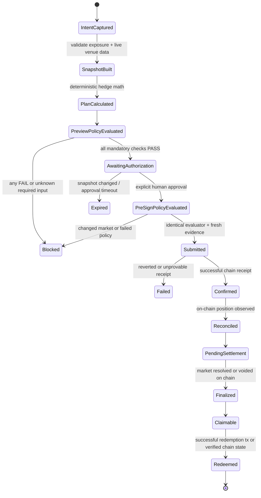

# OutcomeGuard Architecture

Status: implementation target, last verified against official sources on 2026-08-28.

OutcomeGuard turns an existing BTC or ETH exposure and a bounded protection intent into a deterministic Event Contract hedge on DreamDEX. Arithmetic, policy decisions, authorization, and transaction construction remain outside the AI trust boundary. The agent may explain or normalize an intent, but it cannot change a calculation, waive a failed policy, or sign a transaction.

## Deployment facts

| Item | Pinned value | Source |
| --- | --- | --- |
| Markets SDK | `@somnia-chain/markets-sdk@0.28.1` | [npm registry metadata](https://registry.npmjs.org/@somnia-chain/markets-sdk/latest) |
| SDK publication | `2026-08-21T12:59:31.151Z` | npm registry metadata |
| SDK integrity | `sha512-CwrYT/kSKaCxYk9ehdOPxGggOrRepaJIEH9tTQINGn4iHIDmE7kMoP33Da0GS0MA4LIt57mRnOnru0NZnnCU7A==` | npm registry metadata |
| Network | Somnia Shannon testnet | [Somnia/DreamDEX documentation](https://docs.dreamdex.io/developers/event-contracts) |
| Chain ID | `50312` | official documentation and SDK chain definition |
| Indexer | `https://dev.smk.somnia.host/v1/graphql` | SDK 0.28.1 README |
| WebSocket RPC | `wss://api.infra.testnet.somnia.network/ws` | SDK 0.28.1 README |
| Explorer | `https://shannon-explorer.somnia.network` | official documentation |
| SDK address bundle | `SOMNIA_TESTNET_ADDRESSES` | SDK 0.28.1 README |
| Event collateral on Shannon | `tUSDC`, 6 decimals, `0x70a86D8842FB63C4Ad2b7cdddF530eBf1BB25d8E` | [Event Contract addresses](https://docs.dreamdex.io/developers/event-contracts/contracts-and-addresses) |

The SDK must be pinned exactly in the lockfile. The official documentation requires version 0.28.0 or newer: versions before 0.23.0 no longer read the current indexer schema, and versions before 0.28.0 can convert ordinary JavaScript float prices to values outside an 18-decimal venue's tick grid. OutcomeGuard still uses integer arithmetic and validates tick and lot alignment rather than relying on this SDK fix alone.

The product language may express a premium budget in “USDso,” but the verified Shannon Event Contract venue currently uses 6-decimal `tUSDC`. The execution UI, authorization payload, receipt, and evidence must display the token symbol, address, and decimals actually returned by the selected venue. They must never silently relabel tUSDC as USDso.

## System structure

The diagram below is the target transaction lifecycle. At this checkpoint the web implements preview plus a verified exact raw-unit execution mandate and the DreamDEX adapter implements the guarded write boundary; the durable execution coordinator between them is not yet wired or evidenced.

```mermaid
flowchart LR
    U[User] -->|intent + structured limits| W[Web application]
    WAL[Injected wallet] -->|address, balances, signature, tx| W
    W --> S[Strict schemas]
    S --> H[Deterministic hedge engine]
    IDX[DreamDEX indexer] -->|discovery/history| D[DreamDEX adapter]
    RPC[Shannon RPC] -->|status, params, balances, receipt| D
    D --> H
    H --> P[Versioned policy engine]
    P -->|PASS/WARN/FAIL + evidence| W
    W -->|explicit approval bound to snapshot hash| X[Execution coordinator]
    P -->|same evaluator, fresh inputs| X
    X --> Q[Serialized signer queue]
    Q --> SDK[@somnia-chain/markets-sdk 0.28.1]
    SDK --> RPC
    X --> R[Canonical receipt builder]
    D --> R
    R --> V[Receipt verifier / explorer]
    A[Agent worker] -->|refresh, reconcile, settlement, roll proposal| D
    A --> P
    FIX[Signed-in-repo fixtures] -->|offline judge replay| D
```

The indexer supplies discovery, venue metadata, and history. Every write is scoped to an explicit allowed venue and gated by a fresh on-chain market read, wallet/token balance reads, book parameters, and chain ID. The current SDK does not expose an independent on-chain venue-membership proof, so that provenance remains a disclosed indexer trust. Missing or contradictory data becomes `unknown` and fails closed.

## Package responsibilities

| Component | Responsibility | Must not do |
| --- | --- | --- |
| `apps/web` | Exposure and intent entry, live market presentation, scenario chart, visible policy gate, exact execution-mandate signature, receipt explorer, labeled judge replay; transaction approval/status remain target coordinator work | Hold private keys; infer successful execution from a submitted hash |
| `apps/agent` | Refresh discovery and books, recompute proposals, serialize a dedicated test-agent signer, reconcile positions, monitor settlement, propose rolling protection | Write mainnet; bypass approval; mutate historical receipts |
| `packages/dreamdex` | Venue-scoped discovery, market-ID identity, chain verification, book reads, integer quantization, IOC placement, receipt/status checks, positions, finalized history, redemption | Trust indexer status for writes; hardcode decimals or per-window pools |
| `packages/hedge-engine` | Deterministic hedge sizing and scenario P&L using integers/decimal strings; report basis risk | Predict price; promise perfect protection |
| `packages/policy-engine` | Versioned, deterministic, fail-closed preview and pre-sign checks | Accept a policy override from an LLM or client-only state |
| `packages/receipt` | Canonical JSON, SHA-256 digest, linked lifecycle versions, independent verification | Include secrets; rewrite an earlier receipt |
| `packages/schemas` | Runtime validation for intents, market data, policies, receipts, environment, fixture provenance | Coerce malformed external data into plausible values |

## Intent-to-settlement lifecycle



Each transition appends a new canonical receipt whose `previousReceiptDigest` points to the prior version. A stage is not represented as complete without the evidence required by that stage. Historical replay uses the same lifecycle schema but carries `mode: "verified-replay"` and source transaction links; it is never presented as a live user transaction.

## Hedge calculation boundary

For an adverse underlying move, the baseline calculation is:

```text
underlyingLoss      = exposureUsd × adverseMovePct
netPayoutIfDown     = shares × (1 - executablePrice)
premiumAtRiskIfUp   = shares × executablePrice
requiredShares      = targetProtectedLoss / (1 - executablePrice)
```

The selected quantity is quantized down to the venue lot grid, then bounded by executable depth, premium budget, total risk, per-market share limit, price impact, spread, slippage, expiry headroom, allowed asset/horizon, and existing exposure. The scenario chart and receipt consume the same calculation object; neither reimplements the formulas.

Binary protection is nonlinear and has strike, timing, liquidity, oracle, and basis risk. “Down” pays only if the contract's settlement rule resolves Down; a spot loss does not guarantee a payout. The UI must show this limitation adjacent to the before/after chart and authorization.

## Execution protocol

1. Discover candidates with `listLiveBinaryMarkets`, scoped to the configured venue.
2. Identify state by `marketId`; treat a pool address as reusable infrastructure, not market identity.
3. Read the book and `getBinaryBookParams`; read collateral metadata dynamically.
4. Fetch `getMarketOnchain(marketId)` and require on-chain status `1` (`Trading`).
5. Calculate and quantize with exact units. Reject zero size and any budget/depth overflow after quantization.
6. Produce the preview policy result and authorization payload hash.
7. Immediately before signing, refresh the market, book, balances, gas, parameters, expiry, and chain ID. Run the same policy evaluator and invalidate approval when tolerance is exceeded.
8. Target protocol: durably claim the authorization, reserve/reconcile the signer nonce, then submit the bounded IOC with its signed future nanosecond expiry. The current adapter only serializes within one process and write mode remains disabled until the durable coordinator is complete.
9. Require a successful mined receipt. For unified SDK calls the receipt is in `order.info as PlaceOrderResult`; a transaction hash alone is not confirmation.
10. Reconcile fills and the position from chain data. Persist a linked post-execution receipt.
11. Discover terminal markets using finalized binary-market history, verify resolution, redeem explicitly, and persist settlement/redemption receipts.

## Reliability modes

- `live-read`: real Shannon discovery and order books; no write authorization.
- `dry-run`: real or fixture inputs, full calculation and policy path, signer unreachable.
- `testnet-execute`: Shannon-only, explicit human authorization, bounded writes.
- `deterministic-fixture`: checked-in, schema-validated snapshots with expected digests and calculations.
- `verified-replay`: immutable historical Shannon evidence for settlement/redemption; clearly labeled in UI and receipt.

No configuration mode can resolve writes to chain ID 5031. Startup diagnostics log mode, chain ID, venue ID, SDK version, address-bundle fingerprint, and endpoint hosts, but never keys, tokens, signed payloads, or full authorization headers.

## Source-of-truth hierarchy

For authorization and execution, the precedence is:

1. Successful Shannon transaction receipt and direct on-chain state.
2. Direct on-chain market, order, balance, token metadata, and position reads.
3. DreamDEX indexer for discovery and historical queries, reconciled against chain.
4. Versioned local fixtures for offline demonstration only.

Indexer absence is not an empty market or zero balance. RPC disagreement, missing reads, ambiguous venue/network configuration, stale data, or an unreproducible receipt input blocks execution.

See [Trust Boundaries](architecture/trust-boundaries.md) and [Threat Model](THREAT_MODEL.md) for the security model.
