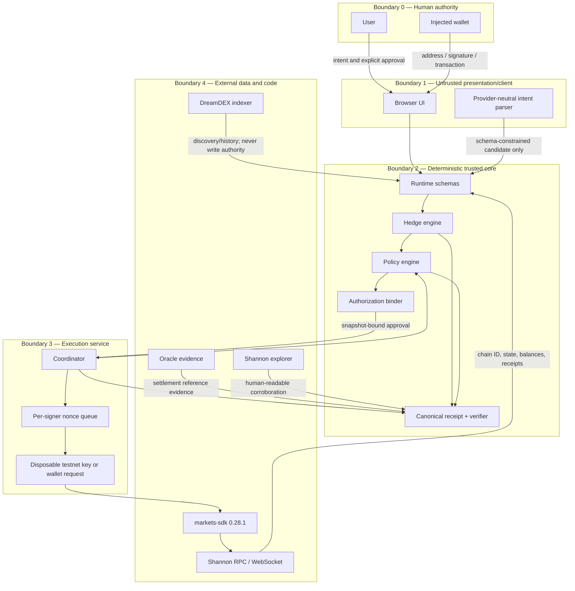

# Trust Boundaries

Last reviewed: 2026-08-28. Target network: Somnia Shannon testnet, chain ID `50312`.

OutcomeGuard treats every input outside the deterministic core as untrusted until it is validated, freshness-checked, bound into an authorization digest, and—where relevant—reconciled against Shannon state.

## Boundary contracts

| Crossing | Validation and control | Failure behavior |
| --- | --- | --- |
| User text → intent | Strict schema, allowed BTC/ETH, bounded horizon and numeric ranges; prompt content remains data | Reject or require structured correction; never infer execution authority |
| Browser → deterministic core | Runtime validation; recompute all arithmetic and policies; ignore client-provided PASS results | Fail closed |
| Indexer → market snapshot | Schema, venue scope, market ID, timestamp, nonempty book, monotonic sanity checks; reconcile status on chain | Mark unknown/stale; no signing |
| RPC → authorization | Allowlisted Shannon chain ID and contracts; multiple related reads pinned as closely as practical; freshness limit | Reject ambiguity or inconsistency |
| Plan → authorization | Hash exact intent, portfolio, market snapshot, normalized order, policy version, limits, chain, venue, and expiry | Any change invalidates authorization |
| Authorization → signer | Mandatory preview and pre-sign checks use the same evaluator; signer receives only an approved normalized order | Failed/unknown check cannot reach signer |
| Signer → chain | One nonce queue per signer; testnet-only chain assertion; IOC; bounded price/size; future nanosecond expiry | Stop queue on nonce ambiguity; reconcile before retry |
| Chain → execution receipt | Require mined receipt with successful status, expected chain, sender, target, and decoded event/fill evidence | Record failed/submitted, never confirmed |
| Position → settlement | Market-ID keyed finalized discovery; verify on-chain outcome/void state and claimable balance | Remain pending/unknown |
| Settlement → redemption | Explicit authorized tx or independently verified already-redeemed chain state | Never label redeemed from indexer status alone |
| Lifecycle receipt → verifier | Deterministic JSON canonicalization, SHA-256, schema version, linked prior digest | Any changed field fails verification |

## Secrets boundary

The web path uses an injected wallet and receives no private key. The worker may use only a dedicated disposable Shannon key supplied at runtime. Secret values are excluded from structured logs, receipts, evidence, fixtures, error serialization, browser bundles, health endpoints, and support output. Environment validation reports presence and source category, never value or fingerprint derived from key material.

## Replay boundary

Offline reliability is not permission to fabricate state. A replay artifact must include its original network, chain ID, market ID, observed timestamps, transaction hashes, explorer URLs, content digest, and provenance. The UI places “Verified historical replay” next to every lifecycle control and disables language suggesting the current wallet executed the replayed transaction.

## Human authorization boundary

Authorization is a one-time capability, not general consent. It binds:

- signer and chain ID;
- market ID, venue ID, outcome side, collateral token address, and decimals;
- maximum input amount, maximum price, quantity, slippage, and expiry;
- market/book snapshot digest and permitted change tolerance;
- policy-set ID and version;
- approval timestamp and authorization expiry.

Rolling protection always creates a new proposal and authorization. Settlement monitoring may be automatic, but redemption follows the configured authorization method and cannot be inferred from approval of the opening order.

